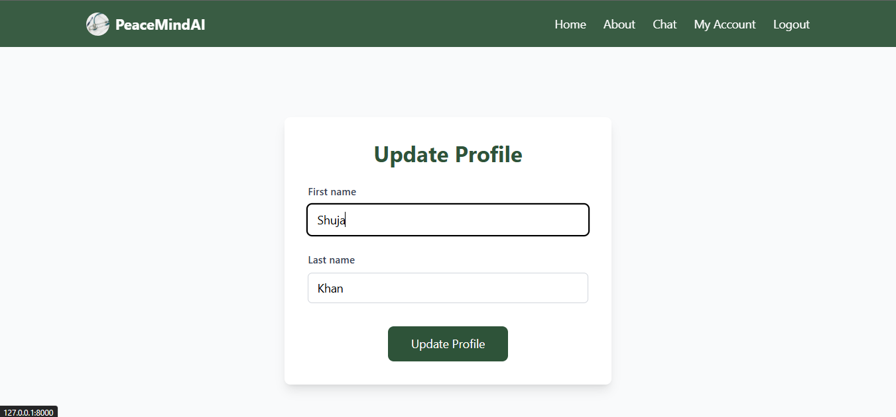

# PeaceMindAI

PeaceMindAI is an AI-powered mental health support platform designed to offer accessible, personalized, and stigma-free emotional care. Built around an advanced Large Language Model (LLM) chatbot, the system helps individuals manage stress, anxiety, depression, and PTSD through meaningful conversations, cognitive behavioral therapy techniques, mindfulness practices, and supportive counseling.

## Table of Contents

- [PeaceMindAI](#peacemindai)
  - [Table of Contents](#table-of-contents)
  - [Key Features](#key-features)
  - [Technologies Used](#technologies-used)
  - [Purpose](#purpose)
  - [Setup and Installation](#setup-and-installation)
    - [Prerequisites](#prerequisites)
    - [Installation Steps](#installation-steps)
    - [Running with WebSocket Support](#running-with-websocket-support)
    - [Environment Variables](#environment-variables)
    - [Development Commands](#development-commands)
  - [Project Structure](#project-structure)
    - [Workflow Diagram](#workflow-diagram)
  - [AI and Chat System](#ai-and-chat-system)
    - [Chat Architecture](#chat-architecture)
    - [Training Data](#training-data)
    - [AI Capabilities](#ai-capabilities)
    - [Data Privacy and Security](#data-privacy-and-security)
  - [User Interface and Features](#user-interface-and-features)
    - [Home Page](#home-page)
    - [Authentication](#authentication)
    - [Chat Interface](#chat-interface)
    - [Therapeutic Features](#therapeutic-features)
    - [Design Principles](#design-principles)
  - [Development Guidelines](#development-guidelines)
    - [Code Style](#code-style)
    - [Best Practices](#best-practices)
    - [Testing](#testing)
  - [Contributing](#contributing)
    - [Areas for Contribution](#areas-for-contribution)
  - [License](#license)
  - [Acknowledgments](#acknowledgments)
  - [Screenshots](#screenshots)
    - [Home Page](#home-page-1)
    - [Registeration Page](#registeration-page)
    - [Login Page](#login-page)
    - [Profile Update](#profile-update)
    - [About Page](#about-page)
    - [Chat Section](#chat-section)
  - [Support](#support)
  - [Disclaimer](#disclaimer)

## Key Features

- **24/7 AI-Powered Support**: Round-the-clock access to conversational mental health support
- **Evidence-Based Therapy**: Implements principles from Cognitive Behavioral Therapy (CBT) and mindfulness-based techniques
- **Personalized Care**: Tailored responses based on user interaction history and specific mental health needs
- **Multi-Modal Support**: Combines chat interface with curated resources and guided exercises
- **Privacy-Focused**: Ensures user confidentiality and secure data handling
- **User-Friendly Interface**: Clean, intuitive web interface built with modern design principles

## Technologies Used

- **Backend**: Django 5.2, Django Channels (WebSocket support)
- **Frontend**: TailwindCSS, HTML5
- **AI/ML**: LangChain, HuggingFace Models
- **Database**: SQLite, ChromaDB (Vector Database)
- **Message Handling**: WebSocket for real-time chat
- **Development Tools**: Python 3.12+

## Purpose

The platform aims to address the growing need for accessible mental health support by providing:

- Immediate emotional support without wait times
- Evidence-based therapeutic techniques
- A stigma-free environment for mental health discussions
- Accessible care regardless of location or time
- Support for common mental health challenges

## Setup and Installation

### Prerequisites

- Python 3.12 or higher
- Git
- pip (Python package installer)
- virtualenv (recommended)
- Node.js and npm (for frontend development)
- Database: SQLite (default) or PostgreSQL
- A Groq API key for LLM functionality

### Installation Steps

1. Clone the repository:

```bash
git clone https://github.com/yourusername/PeaceMindAI.git
cd PeaceMindAI
```

2. Create and activate a virtual environment:

```bash
python -m venv venv
# On Windows
venv\Scripts\activate
# On Unix or MacOS
source venv/bin/activate
```

3. Install required packages:

```bash
pip install -r requirements.txt
```

4. Install frontend dependencies:

```bash
cd peacemindai/theme/static_src
npm install
npm run build
```

5. Initialize the database:

```bash
python manage.py migrate
```

6. Run the development server:

```bash
python manage.py runserver
```

The application will be available at `http://localhost:8000`

### Running with WebSocket Support

For WebSocket support (required for chat functionality), use Daphne:

```bash
daphne -b 127.0.0.1 -p 8000 peacemindai.asgi:application
```

### Environment Variables

Create a `.env` file in the project root with the following variables:

```env
# Required
API_KEY=your_groq_api_key
SECRET_KEY=your_django_secret_key
DEBUG=True  # Set to False in production

# Optional
DATABASE_URL=sqlite:///db.sqlite3  # Default SQLite database
ALLOWED_HOSTS=localhost,127.0.0.1
CSRF_TRUSTED_ORIGINS=http://localhost:8000
```

### Development Commands

1. Initialize the database:

```bash
python manage.py makemigrations
python manage.py migrate
```

2. Create a superuser (admin):

```bash
python manage.py createsuperuser
```

3. Run the development server:

```bash
python manage.py runserver
```

4. Run with WebSocket support (required for chat):

```bash
daphne -b 127.0.0.1 -p 8000 peacemindai.asgi:application
```

5. Run tests:

```bash
python manage.py test
```

The application will be available at:

- Main application: http://localhost:8000
- Admin interface: http://localhost:8000/admin

## Project Structure

The project is organized as follows:

```
PeaceMindAI/
├── README.md               # Project documentation
├── requirements.txt        # Python dependencies
├── peacemindai/            # Main project folder
│   ├── db.sqlite3          # SQLite database (default)
│   ├── manage.py           # Django management script
│   ├── chat/               # Chat application
│   │   ├── consumers.py    # WebSocket consumers
│   │   ├── models.py       # Chat data models
│   │   ├── routing.py      # WebSocket routing
│   │   ├── utils.py        # Utility functions
│   │   ├── views.py        # Chat views
│   │   ├── data_source/    # Data sources for AI
│   │   │   ├── Huggingface-mental-health-data.json
│   │   │   ├── Intents.json
│   │   │   └── mental_health_Document.pdf
│   │   ├── templates/      # Chat-specific templates
│   │   └── chroma_db/      # Vector database for AI
│   ├── main_app/           # Core application
│   │   ├── models.py       # Core data models
│   │   ├── views.py        # Main views
│   │   ├── templates/      # Core templates
│   │   └── migrations/     # Database migrations
│   ├── users/              # User management
│   │   ├── forms.py        # User forms
│   │   ├── models.py       # User models
│   │   ├── templates/      # User-specific templates
│   │   └── migrations/     # Database migrations
│   ├── templates/          # Global templates
│   ├── static/             # Static files
│   │   └── images/         # Image assets
│   ├── theme/              # TailwindCSS theme
│   │   ├── static_src/     # Source files for TailwindCSS
│   │   └── templates/      # Theme templates
│   ├── settings.py         # Django settings
│   ├── urls.py             # URL configuration
│   ├── asgi.py             # ASGI configuration
│   └── wsgi.py             # WSGI configuration
```

### Workflow Diagram

The following diagram illustrates the workflow of the PeaceMindAI system:

<!-- Excallidraw work remain -->

These visuals provide a clearer understanding of the project structure and workflow. For more details, refer to the respective sections in this documentation.

## AI and Chat System

### Chat Architecture

The chat system uses a real-time WebSocket connection to enable instant communication between users and the AI. Key components include:

- **WebSocket Consumer**: Handles real-time message processing and routing
- **Vector Database**: ChromaDB for efficient storage and retrieval of conversational context
- **LangChain Integration**: Orchestrates the interaction between different AI components
- **Response Generation**: Uses Groq's LLM API for generating contextually appropriate responses

### Training Data

The system is trained on carefully curated mental health datasets:

- Mental health conversations and responses
- Therapeutic techniques and interventions
- Common mental health concerns and appropriate responses
- Evidence-based coping strategies

### AI Capabilities

- **Context Awareness**: Maintains conversation context for more meaningful interactions
- **Pattern Recognition**: Identifies emotional patterns and potential mental health concerns
- **Therapeutic Techniques**: Implements CBT, mindfulness, and other evidence-based approaches
- **Resource Recommendations**: Suggests relevant self-help resources and coping strategies
- **Crisis Detection**: Identifies potential crisis situations and provides appropriate responses

### Data Privacy and Security

- All conversations are encrypted and securely stored
- Personal information is anonymized
- No conversation data is used for training without explicit consent
- Regular data purging policies in place
- Compliance with mental health data protection standards

## User Interface and Features

### Home Page

The landing page showcases key features and benefits:

- Hero section with clear value proposition
- Feature highlights including CBT, mindfulness therapy, and supportive counseling
- Benefits section highlighting 24/7 availability, privacy, and AI capabilities
- Clear calls-to-action for signup and learning more

### Authentication

- Secure user registration and login system
- OAuth support for social login (planned feature)
- Password recovery and reset functionality
- Session management for persistent conversations

### Chat Interface

- Real-time message exchange
- Typing indicators and message status
- Message history preservation
- Markdown support for formatted responses
- Resource linking and recommendations
- Emergency contact information readily available

### Therapeutic Features

1. **Guided Sessions**:

   - Structured therapeutic conversations
   - Progress tracking and mood monitoring
   - Customized exercise recommendations
   - Mindfulness and relaxation techniques

2. **Resource Library**:

   - Self-help articles and guides
   - Mindfulness exercises
   - Coping strategies
   - Crisis management resources

3. **Progress Tracking**:
   - Mood tracking functionality
   - Session history review
   - Progress visualization
   - Goal setting and achievement tracking

### Design Principles

- Clean, minimalist interface to reduce cognitive load
- Calming color scheme (hunter-green, aquamarine, tea-rose-red)
- Responsive design for all device sizes
- Accessibility compliance
- Intuitive navigation and clear user flows

## Development Guidelines

### Code Style

- Follow PEP 8 guidelines for Python code
- Use Django's coding style for templates and models
- Follow BEM methodology for CSS classes
- Maintain consistent indentation (4 spaces for Python)

### Best Practices

- Write meaningful commit messages
- Document all functions and classes
- Write unit tests for new features
- Keep functions small and focused
- Use type hints in Python code
- Follow the DRY (Don't Repeat Yourself) principle

### Testing

To run the test suite:

```bash
python manage.py test
```

For coverage report:

```bash
coverage run manage.py test
coverage report
```

## Contributing

We welcome contributions to PeaceMindAI! Here's how you can help:

1. Fork the repository
2. Create a feature branch (`git checkout -b feature/AmazingFeature`)
3. Commit your changes (`git commit -m 'Add some AmazingFeature'`)
4. Push to the branch (`git push origin feature/AmazingFeature`)
5. Open a Pull Request

### Areas for Contribution

- Enhanced AI response capabilities
- Additional therapeutic techniques
- UI/UX improvements
- Documentation updates
- Bug fixes and optimizations
- Test coverage improvements

## License

This project is licensed under the MIT License - see the LICENSE file for details.

## Acknowledgments

- Mental health professionals who provided guidance
- Open-source AI and ML communities
- Contributors and testers
- Django and Python communities

## Screenshots

### Home Page


### Registeration Page


### Login Page


### Profile Update


### About Page


### Chat Section


## Support

For support, please:

- Open an issue on GitHub
- Join our Discord community (coming soon)
- Email: suhelkhanca@gmail.com

## Disclaimer

PeaceMindAI is not a substitute for professional mental health treatment. If you're experiencing a mental health crisis, please contact emergency services or a mental health professional immediately.
